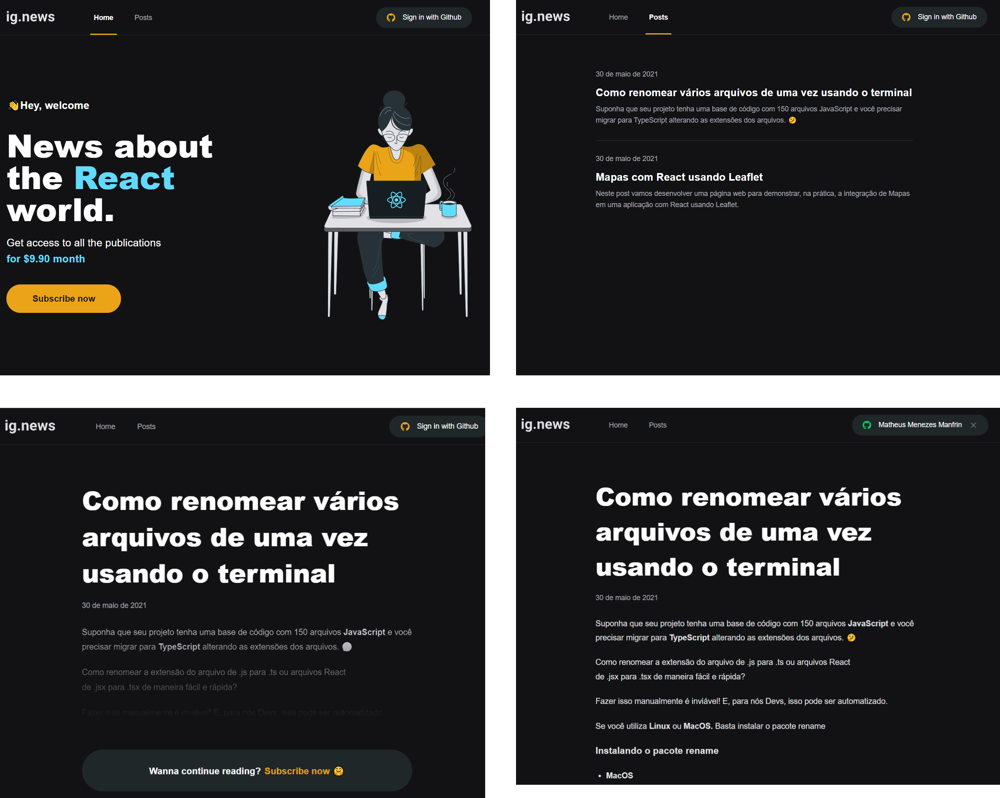

  

  

 

# 👨🏻‍💻 Introduction

## Objective

Learn about JAMStack (Javascript, API and Markup).

## This repository has

A Newsletter with:

- OAuth with GitHub.
- HandlessCMS to create posts.
- Gateway payments for subscriptions.

## Project

This project was done through a module of the [Rocketseat](https://rocketseat.com.br) course.

  

# 🚀 Technologies used

- [NextJs](https://nextjs.org/)
- [NextJs Auth](https://next-auth.js.org/)
- [Sass](https://sass-lang.com/)
- [Prismic](https://prismic.io/)
- [Fauna DB](https://fauna.com/)
- [Stripe](https://stripe.com/br)

---

Made by Matheus Menezes Manfrin 🦥 [See my LinkedIn](https://www.linkedin.com/in/manfrinmm)

<!-- ## Dev

### Stripe

Run stripe webhook on localhost:
`docker run --rm -it stripe/stripe-cli listen --forward-to host.docker.internal:3000/api/webhooks --api-key your_api_key` -->
